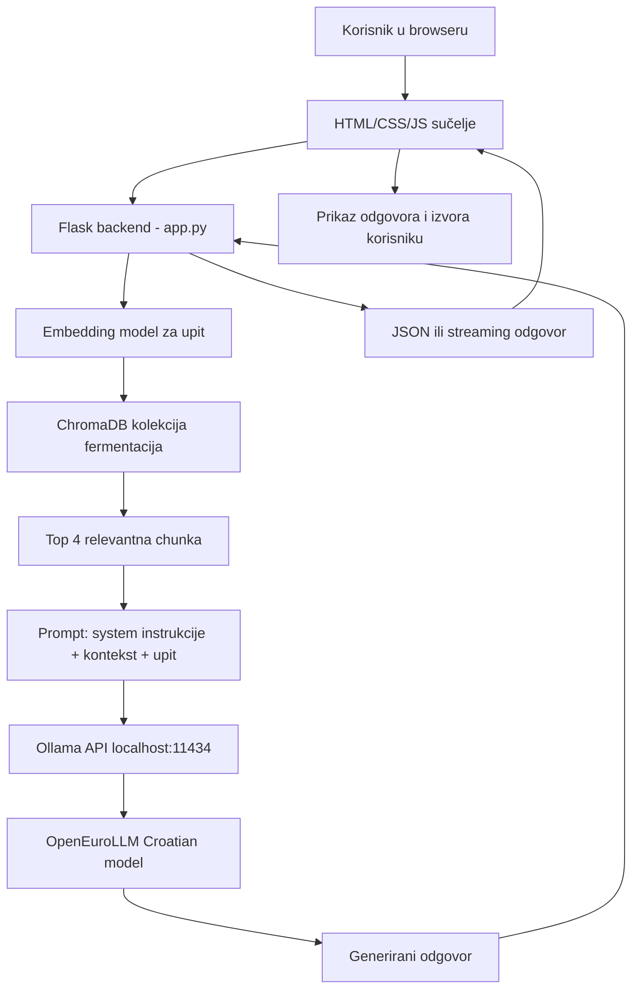
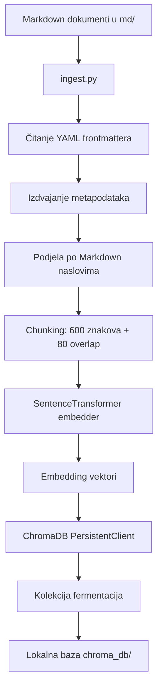
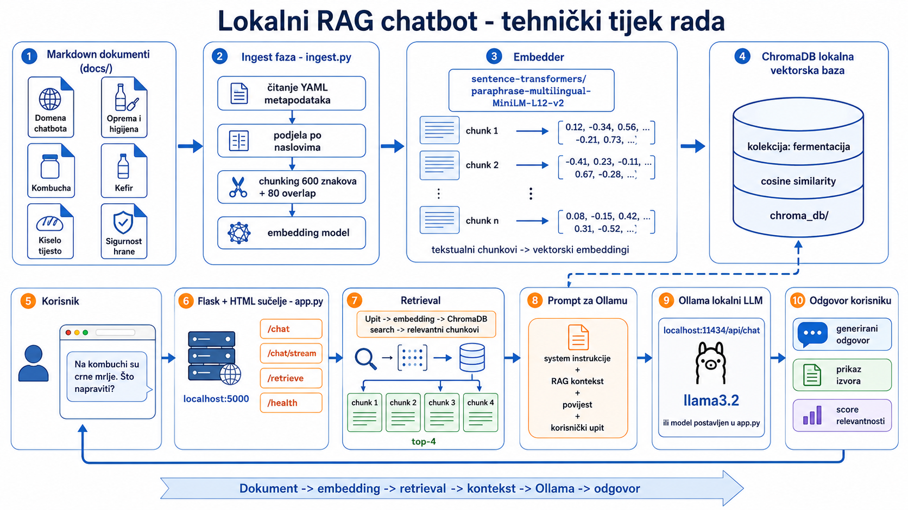

# Dokumentacija projekta - Faza 2: lokalni RAG chatbot s Ollamom

## 1. Uvod

Ovaj projekt implementira lokalni RAG chatbot za domenu kućne fermentacije. Chatbot korisniku omogućuje postavljanje pitanja o temama kao što su kiseli kupus, kimchi, kefir, kombucha, kiselo tijesto, higijena, oprema i sigurnost hrane. Sustav ne odgovara samo iz općeg znanja jezičnog modela, nego prije generiranja odgovora pretražuje lokalnu bazu znanja i u prompt modelu šalje relevantne dijelove dokumenata.

RAG znači Retrieval-Augmented Generation. U ovom projektu to znači da sustav najprije dohvaća relevantne tekstualne chunkove iz lokalnih Markdown dokumenata, zatim ih dodaje u kontekst upita i tek nakon toga šalje upit lokalnom Ollama modelu. Time se smanjuje rizik netočnih ili izmišljenih odgovora jer model dobiva konkretne informacije iz pripremljene baze znanja.

Projekt je u potpunosti lokalno izveden:

- dokumenti su spremljeni u mapi `md/`
- embedding vektori se spremaju u lokalni `chroma_db/`
- jezični model se pokreće preko Ollame na `localhost:11434`
- web sučelje se pokreće preko Flask aplikacije na `localhost:3000`

## 2. Cilj faze 2

Cilj Faze 2 bio je izgraditi funkcionalni lokalni RAG pipeline koji može:

- učitati najmanje tri lokalna dokumenta
- podijeliti dokumente na manje tekstualne cjeline
- vektorizirati tekst pomoću embedding modela
- spremiti vektore u lokalnu vektorsku bazu
- na temelju korisničkog upita dohvatiti relevantne chunkove
- poslati korisnički upit i dohvaćeni kontekst lokalnom LLM-u
- prikazati odgovor u lokalnom web sučelju
- prikazati izvore na temelju kojih je odgovor generiran

U implementaciji je korišteno više od tri dokumenta. Baza znanja nalazi se u mapi `md/` i sadrži dokumente o domeni chatbota, opremi i higijeni, fermentaciji povrća, kefiru, kombuchi, kiselom tijestu, sigurnosti, vodičima i primjerima pitanja.

## 3. Odabrani Ollama model

U trenutnoj verziji datoteke `app.py` model je postavljen ovako:

```python
OLLAMA_MODEL = "jobautomation/OpenEuroLLM-Croatian:latest"
```

Model se lokalno preuzima naredbom:

```bash
ollama pull jobautomation/OpenEuroLLM-Croatian:latest
```

U nastavku dokumentacije objašnjen je izbor modela `jobautomation/OpenEuroLLM-Croatian:latest` kao glavnog lokalnog modela za Fazu 2.

## 4. Zašto je odabran OpenEuroLLM Croatian preko Ollame

Model `jobautomation/OpenEuroLLM-Croatian:latest` odabran je zato što daje kvalitetnije odgovore na hrvatskom jeziku od općenitijih lokalnih modela. Projektni dokumenti, korisnički upiti i sučelje su na hrvatskom jeziku, pa je jezična kvaliteta važnija od maksimalne brzine generiranja. Model je nešto sporiji, ali je to prihvatljivo jer je cilj projekta demonstrirati ispravan RAG tok i kvalitetan odgovor, a ne postići najkraće moguće vrijeme generiranja.

Za studentski projekt lokalnog RAG chatbota važno je i da model može raditi bez vanjskog API-ja, bez slanja podataka u cloud i bez dodatnih troškova po upitu. Ollama omogućuje upravo takav način rada jer pokreće model lokalno i izlaže jednostavan HTTP API.

Glavni razlozi odabira:

1. Lokalno izvođenje

   Model se pokreće na lokalnom računalu, što znači da dokumenti, upiti i odgovori ostaju na korisnikovom uređaju. To je posebno korisno za demonstraciju RAG sustava jer se cijeli pipeline može prikazati bez ovisnosti o vanjskim servisima.

2. Dobar omjer kvalitete i performansi

   `jobautomation/OpenEuroLLM-Croatian:latest` je sporiji od nekih manjih modela, ali daje prirodnije i preciznije odgovore na hrvatskom jeziku. U ovom projektu brzina nije presudna jer se aplikacija koristi kao lokalni demonstracijski chatbot, a RAG kontekst pomaže modelu da odgovara iz pripremljene baze znanja.

3. Prikladan za RAG način rada

   Kod RAG arhitekture najvažnije je da model zna koristiti dobiveni kontekst i oblikovati jasan odgovor. OpenEuroLLM Croatian je prikladan za ovaj zadatak jer bolje prati hrvatski tekst, prirodnije formulira odgovore i može sintetizirati informacije iz više dohvaćenih chunkova.

4. Jednostavna integracija

   Ollama nudi lokalni API na adresi `http://localhost:11434/api/chat`. U aplikaciji se taj API poziva pomoću Python knjižnice `requests`, bez složenog SDK-a ili posebne konfiguracije.

5. Pogodan za demonstraciju

   Za prezentaciju je važno da se model može lako pokrenuti naredbama:

   ```bash
   ollama serve
   ollama pull jobautomation/OpenEuroLLM-Croatian:latest
   python app.py
   ```

6. Posebno dobar za hrvatski jezik

   Projektni dokumenti i korisničko sučelje su na hrvatskom jeziku. Zbog toga je odabran model koji je usmjeren na hrvatski jezik, što poboljšava stil, razumljivost i terminološku usklađenost odgovora. Kvaliteta se dodatno poboljšava jer model dobiva hrvatski kontekst iz lokalne baze znanja.

## 5. Zašto je odabran embedding model

U datotekama `app.py` i `ingest.py` koristi se isti embedding model:

```python
EMBED_MODEL = "sentence-transformers/paraphrase-multilingual-MiniLM-L12-v2"
```

Ovaj model služi za pretvaranje teksta u numeričke vektore. Ti vektori predstavljaju značenje teksta i omogućuju semantičku pretragu. To znači da sustav ne traži samo doslovno iste riječi, nego pokušava pronaći dijelove dokumenata koji su značenjski slični korisničkom upitu.

Razlozi odabira ovog embeddera:

1. Višejezična podrška

   Model je multilingual, što znači da podržava više jezika, uključujući hrvatski. To je ključno jer su projektni dokumenti i korisnički upiti na hrvatskom jeziku.

2. Dobar za parafraze

   Naziv modela sadrži `paraphrase`, što upućuje na to da je model treniran za prepoznavanje semantičke sličnosti između rečenica koje ne moraju koristiti iste riječi. Primjerice, upit "kombucha ima crne mrlje" može biti povezan s dokumentom koji govori o "obojenoj plijesni na površini".

3. Manji i brži model

   MiniLM modeli su relativno mali i brzi. To je korisno za lokalnu aplikaciju jer embedding upita treba nastati brzo pri svakom korisničkom pitanju.

4. Praktičan za ChromaDB

   Model vraća vektore koji se mogu direktno spremiti u ChromaDB. U `ingest.py` se koristi za vektorizaciju svih chunkova dokumenata, a u `app.py` za vektorizaciju korisničkog upita.

5. Isti model za ingest i retrieval

   Važno je da se isti embedding model koristi i kod spremanja dokumenata i kod pretraživanja. Ako bi se dokumenti vektorizirali jednim modelom, a upiti drugim, sličnost vektora ne bi bila pouzdana. Ovdje su `app.py` i `ingest.py` usklađeni i koriste isti `EMBED_MODEL`.

## 6. Korištene tehnologije

| Komponenta        | Tehnologija                                                   | Uloga                                             |
| ----------------- | ------------------------------------------------------------- | ------------------------------------------------- |
| Lokalni LLM       | Ollama + `jobautomation/OpenEuroLLM-Croatian:latest`          | Generiranje završnog odgovora na hrvatskom jeziku |
| Embedding model   | `sentence-transformers/paraphrase-multilingual-MiniLM-L12-v2` | Pretvaranje teksta i upita u vektore              |
| Vektorska baza    | ChromaDB                                                      | Lokalna pohrana embeddinga i semantička pretraga  |
| Backend           | Flask                                                         | Web server i API rute                             |
| Frontend          | HTML, CSS, JavaScript                                         | Lokalno chat sučelje u browseru                   |
| Dokumenti         | Markdown + YAML frontmatter                                   | Lokalna baza znanja                               |
| HTTP komunikacija | `requests`                                                    | Slanje prompta Ollama API-ju                      |
| Metadata parsing  | `pyyaml`                                                      | Čitanje metapodataka iz dokumenata                |

## 7. Struktura projekta

```text
rag_chatbot/
├── app.py
├── ingest.py
├── requirements.txt
├── README.md
├── FAZA2_DOKUMENTACIJA.md
├── chroma_db/
│   ├── chroma.sqlite3
│   └── ...
├── md/
│   ├── 01_domena_chatbota.md
│   ├── 02_oprema_i_higijena.md
│   ├── 03_fermentacija_povrca.md
│   ├── 04_kefir_i_mlijecna_fermentacija.md
│   ├── 05_kombucha_i_fermentacija_caja.md
│   ├── 06_kiselo_tijesto.md
│   ├── 07_sigurnost_i_kvarenje.md
│   ├── 08_vodici_po_koracima.md
│   ├── 09_pravila_odgovaranja_chatbota.md
│   ├── 10_primjeri_pitanja_i_odgovora.md
│   ├── 11_podaci_za_rag_opis.md
│   └── README_RAG.md
└── templates/
    └── index.html
```

## 8. Uloga datoteke ingest.py

Datoteka `ingest.py` priprema dokumente za RAG sustav. Ona se pokreće prije aplikacije kako bi se lokalni Markdown dokumenti pretvorili u vektorsku bazu.

Glavni koraci u `ingest.py`:

1. Učitavanje Markdown dokumenata iz mape `md/`
2. Čitanje YAML frontmattera
3. Izdvajanje metapodataka kao što su naslov, tip izvora i tagovi
4. Dijeljenje teksta po Markdown naslovima
5. Dijeljenje duljih sekcija na chunkove
6. Vektorizacija chunkova embedding modelom
7. Kreiranje ChromaDB kolekcije
8. Spremanje chunkova, vektora i metapodataka
9. Izvođenje demo retrieval testa

### 8.1. Učitavanje dokumenata

Funkcija `load_documents(folder)` prolazi kroz sve `.md` datoteke u mapi `md/`. Svaki dokument se otvara, čita i obrađuje. Dokumenti sadrže YAML frontmatter na početku, primjerice:

```yaml
---
title: "Kombucha i fermentacija čaja"
domain: "Kućna fermentacija"
language: "hr"
source_type: "baza znanja"
tags: ["kombucha", "fermentacija čaja", "SCOBY", "sigurnost hrane"]
---
```

Ovi metapodaci kasnije pomažu u prikazu izvora korisniku.

### 8.2. Parsiranje frontmattera

Funkcija `parse_frontmatter(text)` provjerava počinje li dokument s `---`. Ako počinje, pokušava pročitati YAML dio i odvojiti ga od glavnog teksta dokumenta. Rezultat je par:

- `meta`: rječnik s metapodacima
- `body`: glavni tekst dokumenta

### 8.3. Podjela po naslovima

Funkcija `split_by_headings(body)` dijeli dokument na sekcije prema Markdown naslovima. Koristi se regex koji prepoznaje naslove oblika:

```text
# Naslov
## Podnaslov
### Manji podnaslov
```

Ova podjela je korisna jer naslovi obično označavaju logičke cjeline. Tako chunkovi imaju više smisla nego da se tekst dijeli potpuno nasumično.

### 8.4. Chunking

Funkcija `chunk_section(section, size, overlap)` dijeli preduge sekcije na manje dijelove. U projektu su postavljene vrijednosti:

```python
CHUNK_SIZE = 600
CHUNK_OVERLAP = 80
```

To znači da svaki chunk ima približno 600 znakova, a susjedni chunkovi se preklapaju za 80 znakova. Preklapanje je korisno jer smanjuje mogućnost da se važna rečenica prekine na granici između dva chunka.

### 8.5. Spremanje u ChromaDB

Funkcija `build_chroma(md)` stvara lokalnu ChromaDB kolekciju:

```python
COLLECTION = "fermentacija"
```

Kolekcija koristi cosine similarity:

```python
metadata={"hnsw:space": "cosine"}
```

To znači da se sličnost između korisničkog upita i dokumenata računa prema kutu između vektora. Cosine similarity je standardan izbor za semantičku pretragu teksta jer je važan smjer vektora, odnosno značenje, a ne njegova apsolutna veličina.

Za svaki chunk sprema se:

- jedinstveni ID
- tekst chunka
- embedding vektor
- metapodaci: naziv datoteke, naslov, tip izvora, tagovi i indeks chunka

## 9. Uloga datoteke app.py

Datoteka `app.py` pokreće Flask aplikaciju, učitava embedding model, povezuje se na ChromaDB i komunicira s Ollamom.

Glavne konstante u `app.py`:

```python
CHROMA_PATH = "chroma_db"
COLLECTION = "fermentacija"
EMBED_MODEL = "sentence-transformers/paraphrase-multilingual-MiniLM-L12-v2"
OLLAMA_URL = "http://localhost:11434/api/chat"
OLLAMA_MODEL = "jobautomation/OpenEuroLLM-Croatian:latest"
N_RESULTS = 4
```

### 9.1. Učitavanje resursa

Funkcija `load_resources()` učitava embedding model i spaja se na ChromaDB kolekciju. Pokreće se na početku aplikacije:

```python
if __name__ == "__main__":
    load_resources()
    app.run(host="0.0.0.0", port=3000, debug=False)
```

Bez ove funkcije aplikacija ne bi mogla vektorizirati korisnički upit ni dohvatiti chunkove iz baze.

### 9.2. Retrieval

Funkcija `retrieve(query, n=N_RESULTS)` radi dohvat relevantnih chunkova.

Proces:

1. Korisnički upit se pretvara u embedding:

   ```python
   q_emb = embedder.encode([query]).tolist()
   ```

2. ChromaDB traži najsličnije zapise:

   ```python
   collection.query(
       query_embeddings=q_emb,
       n_results=n,
       include=["documents", "metadatas", "distances"],
   )
   ```

3. Rezultat se pretvara u listu chunkova koja sadrži:
   - tekst
   - naziv datoteke
   - naslov dokumenta
   - tagove
   - score

U projektu se dohvaćaju četiri najrelevantnija chunka:

```python
N_RESULTS = 4
```

To je dobar kompromis jer model dobiva dovoljno konteksta, ali prompt ne postaje predug.

### 9.3. Izrada prompta

Funkcija `build_prompt(query, chunks, history)` gradi poruke koje se šalju Ollami.

Sustavski prompt definira ulogu chatbota:

- chatbot je asistent za kućnu fermentaciju
- odgovara samo na pitanja iz domene
- odbija pitanja izvan domene
- ne daje medicinske savjete
- kod sigurnosnih rizika jasno preporučuje odbacivanje proizvoda
- koristi dohvaćene informacije iz baze znanja kao primarni izvor

Svaki chunk se dodaje u kontekst u obliku:

```text
[Izvor 1: Naslov dokumenta | naziv_datoteke.md]
Tekst chunka
```

Na kraju se dodaje korisnički upit. Time model dobiva jasan zadatak: odgovoriti na pitanje koristeći priložene izvore.

### 9.4. Slanje upita Ollami

Funkcija `ask_ollama(messages, stream=False)` šalje HTTP POST zahtjev na:

```text
http://localhost:11434/api/chat
```

Payload sadrži:

```json
{
  "model": "jobautomation/OpenEuroLLM-Croatian:latest",
  "messages": [...],
  "stream": false
}
```

Funkcija ima osnovnu obradu grešaka:

- ako Ollama nije pokrenuta, vraća poruku da treba pokrenuti `ollama serve`
- ako Ollama ne odgovori na vrijeme, vraća timeout grešku

## 10. Flask + HTML sučelje

Projekt koristi Flask zato što je jednostavan, lagan i dovoljan za lokalnu demonstraciju RAG aplikacije. Flask u ovom projektu ima dvije uloge:

- servira HTML sučelje iz `templates/index.html`
- izlaže API rute za chat, streaming, retrieval i health check

### 10.1. Flask rute

| Ruta           | Metoda | Svrha                                          |
| -------------- | ------ | ---------------------------------------------- |
| `/`            | GET    | Prikazuje web sučelje                          |
| `/chat`        | POST   | Prima poruku i vraća kompletan odgovor         |
| `/chat/stream` | POST   | Prima poruku i vraća odgovor token po token    |
| `/retrieve`    | POST   | Vraća samo dohvaćene chunkove bez LLM odgovora |
| `/health`      | GET    | Vraća status aplikacije                        |

### 10.2. Ruta `/`

Ruta `/` vraća HTML stranicu:

```python
return render_template("index.html", model=OLLAMA_MODEL)
```

U sučelju se prikazuje naziv modela koji je trenutno postavljen u `app.py`.

### 10.3. Ruta `/chat`

Ruta `/chat` prima JSON:

```json
{
  "message": "Kako napraviti kombuchu?",
  "history": []
}
```

Zatim:

1. provjerava je li poruka prazna
2. dohvaća relevantne chunkove
3. gradi prompt
4. šalje prompt Ollami
5. vraća odgovor i izvore

Odgovor ima oblik:

```json
{
  "answer": "Tekst odgovora modela...",
  "chunks": [
    {
      "text": "...",
      "filename": "05_kombucha_i_fermentacija_caja.md",
      "title": "Kombucha i fermentacija čaja",
      "tags": "kombucha, fermentacija čaja, SCOBY, sigurnost hrane",
      "score": 0.8123
    }
  ]
}
```

### 10.4. Ruta `/chat/stream`

Ruta `/chat/stream` omogućuje prikaz odgovora dok se generira. Koristi Server-Sent Events format. Prvo šalje dohvaćene chunkove, zatim šalje tokene odgovora jedan po jedan, a na kraju šalje signal `done`.

Ovo poboljšava korisničko iskustvo jer korisnik ne mora čekati da cijeli odgovor bude gotov.

### 10.5. Ruta `/retrieve`

Ruta `/retrieve` koristi se za demonstraciju i debugiranje RAG dijela bez generiranja odgovora. Ako korisnik pošalje upit, aplikacija vraća samo chunkove koje je pronašla u ChromaDB-u. To je korisno za dokazivanje da retrieval radi.

### 10.6. HTML, CSS i JavaScript

Datoteka `templates/index.html` sadrži kompletno lokalno sučelje. Sučelje ima:

- sidebar s nazivom aplikacije i modelom
- područje za prikaz poruka
- unos korisničkog pitanja
- prikaz odgovora modela
- prikaz izvora i dohvaćenih chunkova
- JavaScript logiku za slanje upita Flask backendu

Frontend ne komunicira direktno s Ollamom. On šalje upit Flask aplikaciji, a Flask onda obavlja retrieval i komunikaciju s lokalnim LLM-om.

## 11. Dijagram arhitekture



## 12. Dijagram ingest toka



## 13. Detaljan opis cijelog toka



### 13.1. Priprema baze znanja

Prvo se pripremaju Markdown dokumenti u mapi `md/`. Svaki dokument pokriva jednu temu iz domene kućne fermentacije. Primjeri tema su higijena, kombucha, kefir, kiselo tijesto i sigurnost hrane. Dokumenti su pisani na hrvatskom jeziku i strukturirani naslovima.

Na početku dokumenata nalazi se YAML frontmatter. On sadrži metapodatke koji nisu glavni tekst odgovora, ali pomažu sustavu da zna iz kojeg izvora dolazi chunk. Primjeri metapodataka su `title`, `domain`, `source_type` i `tags`.

### 13.2. Pokretanje ingest procesa

Kada se pokrene:

```bash
python ingest.py
```

skripta učitava dokumente, dijeli ih na chunkove i vektorizira ih. Ako već postoji stara ChromaDB kolekcija istog naziva, ona se briše i gradi se nova. To omogućuje da se promjene u dokumentima odraze u novoj bazi.

### 13.3. Vektorizacija dokumenata

Svaki chunk šalje se embedding modelu `sentence-transformers/paraphrase-multilingual-MiniLM-L12-v2`. Model za svaki chunk vraća vektor. Vektor je numerički prikaz značenja teksta.

Primjer:

```text
"Ako se na kombuchi pojavi crna plijesan, proizvod treba odbaciti."
```

postaje vektor koji je semantički blizak upitima poput:

```text
"Na kombuchi imam tamne mrlje, je li sigurno?"
```

Iako tekst nije isti, značenje je slično, pa retrieval može pronaći odgovarajući chunk.

### 13.4. Spremanje u ChromaDB

ChromaDB sprema:

- originalni tekst chunka
- embedding vektor
- naziv datoteke
- naslov dokumenta
- tagove
- indeks chunka

Baza se sprema lokalno u mapu `chroma_db/`, pa se ne mora iznova graditi svaki put kada se pokrene aplikacija. Ponovno se gradi samo kada se pokrene `ingest.py`.

### 13.5. Pokretanje aplikacije

Kada se pokrene:

```bash
python app.py
```

Flask aplikacija učitava embedding model i postojeću ChromaDB kolekciju. Nakon toga se web sučelje otvara na:

```text
http://localhost:3000
```

Korisnik tada može unijeti pitanje u browseru.

### 13.6. Korisnički upit

Korisnik u HTML sučelju unosi pitanje, primjerice:

```text
Na površini kombuche pojavile su se crne mrlje. Što trebam napraviti?
```

JavaScript šalje taj upit Flask backendu preko `/chat` ili `/chat/stream` rute.

### 13.7. Embedding korisničkog upita

Backend uzima tekst pitanja i koristi isti SentenceTransformer model kao u ingest fazi. Time se korisnički upit pretvara u vektor koji se može usporediti s vektorima spremljenih chunkova.

### 13.8. Retrieval iz ChromaDB-a

ChromaDB uspoređuje vektor upita s vektorima svih spremljenih chunkova. Budući da kolekcija koristi cosine similarity, pronalaze se chunkovi koji su značenjski najbliži upitu.

Za primjer s crnim mrljama na kombuchi, očekivano je da sustav dohvati chunkove iz dokumenata:

- `05_kombucha_i_fermentacija_caja.md`
- `07_sigurnost_i_kvarenje.md`
- `10_primjeri_pitanja_i_odgovora.md`

Ti dokumenti sadrže informacije o plijesni, opasnim bojama, neugodnom mirisu i preporuci odbacivanja proizvoda.

### 13.9. Izrada prompta za LLM

Dohvaćeni chunkovi se formatiraju kao izvori i dodaju u system prompt. Prompt sadrži:

- ulogu chatbota
- ograničenje domene
- sigurnosna pravila
- zabranu medicinskih savjeta
- relevantne chunkove
- povijest razgovora
- trenutno korisničko pitanje

Ovo je ključni RAG korak: model ne dobiva samo pitanje, nego i relevantan kontekst iz lokalne baze znanja.

### 13.10. Slanje prompta Ollami

Flask šalje zahtjev lokalnoj Ollami. Ollama pokreće odabrani model `jobautomation/OpenEuroLLM-Croatian:latest` i generira odgovor. Model je odabran zbog kvalitetnijih odgovora na hrvatskom jeziku. Iako je nešto sporiji od manjih općenitih modela, to je prihvatljivo jer je cilj projekta dobiti razumljiv i jezično prirodan odgovor u lokalnom RAG sustavu.

### 13.11. Vraćanje odgovora korisniku

Backend vraća odgovor frontend sučelju. Uz odgovor vraća i listu chunkova koji su korišteni kao izvori. Korisnik tako može vidjeti ne samo odgovor, nego i dokumente iz kojih je sustav izvukao kontekst.

## 14. Konkretan primjer retrievala

Primjer upita:

```text
Na površini kombuche pojavile su se crne mrlje i miris je neugodan. Je li to normalno?
```

Očekivani dohvat:

1. Chunk iz dokumenta o kombuchi

   Razlog: dokument izravno govori o plijesni na površini kombuche, obojenim mrljama i odbacivanju kulture.

2. Chunk iz dokumenta o sigurnosti i kvarenju

   Razlog: dokument pokriva opće sigurnosne smjernice za plijesan, truli miris i kontaminaciju.

3. Chunk iz primjera pitanja i odgovora

   Razlog: u bazi postoji sličan primjer korisničkog pitanja o crnim mrljama i neugodnom mirisu.

Na temelju tih chunkova model treba odgovoriti da crne mrlje i neugodan miris nisu normalan znak, da proizvod ne treba konzumirati i da je sigurnije odbaciti kombuchu i kulturu.

## 15. Prednosti ovakve arhitekture

1. Lokalni rad bez cloud API-ja

   Sustav se može pokrenuti bez slanja korisničkih podataka van računala.

2. Ažuriranje znanja bez treniranja modela

   Ako se želi dodati nova tema, dovoljno je dodati ili izmijeniti Markdown dokumente i ponovno pokrenuti `ingest.py`.

3. Bolja kontrola odgovora

   System prompt i lokalna baza znanja usmjeravaju model da odgovara samo o kućnoj fermentaciji.

4. Transparentnost

   Korisniku se mogu prikazati izvori, odnosno chunkovi koji su dohvaćeni za njegov upit.

5. Jednostavna demonstracija

   Projekt se može pokazati lokalno kroz browser, bez kompleksne infrastrukture.

## 16. Ograničenja sustava

Sustav ima nekoliko ograničenja:

- kvaliteta odgovora ovisi o kvaliteti dokumenata u `md/`
- ako relevantna informacija nije u bazi znanja, model može dati općenit odgovor
- retrieval može dohvatiti manje relevantne chunkove ako je korisnički upit nejasan
- lokalni modeli mogu biti sporiji na slabijem hardveru
- chatbot ne može stvarno provjeriti sigurnost hrane, nego samo daje oprezne smjernice prema opisu korisnika
- za sigurnosna i medicinska pitanja mora jasno navesti ograničenja

## 17. Kako pokrenuti projekt

Instalacija ovisnosti:

```bash
pip install -r requirements.txt
```

Pokretanje Ollame:

```bash
ollama serve
```

Preuzimanje odabranog modela:

```bash
ollama pull jobautomation/OpenEuroLLM-Croatian:latest
```

Izgradnja ChromaDB baze:

```bash
python ingest.py
```

Pokretanje aplikacije:

```bash
python app.py
```

Otvaranje sučelja:

```text
http://localhost:3000
```

## 18. Sažetak za prezentaciju

U Fazi 2 implementiran je lokalni RAG chatbot za kućnu fermentaciju. Dokumenti iz mape `md/` se obrađuju u `ingest.py`, dijele na chunkove, vektoriziraju pomoću multilingual SentenceTransformer modela i spremaju u ChromaDB. Kada korisnik postavi pitanje u Flask web sučelju, aplikacija vektorizira upit, pronalazi najrelevantnije chunkove u ChromaDB-u, gradi prompt s dohvaćenim kontekstom i šalje ga lokalnom Ollama modelu `jobautomation/OpenEuroLLM-Croatian:latest`. Model generira odgovor na temelju lokalnih izvora, a korisniku se u sučelju prikazuju odgovor i korišteni izvori.

Model OpenEuroLLM Croatian odabran je zato što bolje radi s hrvatskim jezikom od općenitijih lokalnih modela. Iako je nešto sporiji, ta je sporost prihvatljiva jer je za ovaj projekt važnija kvaliteta hrvatskog odgovora, razumljivost i usklađenost s tekstovima iz lokalne baze znanja.

## 19. Prompt za GPT 2.0 za generiranje slike pipelinea i workflowa

Kopiraj sljedeći prompt u alat za generiranje slike:

```text
Create a clean, modern technical workflow diagram for a local RAG chatbot project. The diagram should show the full pipeline from documents to answer generation. Use Croatian labels. Style: professional university project presentation, white background, blue and orange accent colors, clear arrows, readable text, no clutter.

Include these main sections from left to right:

1. "Markdown dokumenti (md/)"
   Show multiple document icons labeled:
   - Domena chatbota
   - Oprema i higijena
   - Kombucha
   - Kefir
   - Kiselo tijesto
   - Sigurnost hrane

2. "Ingest faza - ingest.py"
   Show steps:
   - čitanje YAML metapodataka
   - podjela po naslovima
   - chunking 600 znakova + 80 overlap
   - embedding model

3. "Embedder"
   Label it:
   "sentence-transformers/paraphrase-multilingual-MiniLM-L12-v2"
   Show that text chunks become vector embeddings.

4. "ChromaDB lokalna vektorska baza"
   Show a database cylinder labeled:
   "kolekcija: fermentacija"
   "cosine similarity"
   "chroma_db/"

5. "Korisnik"
   Show a user typing a question in a browser:
   "Na kombuchi su crne mrlje. Što napraviti?"

6. "Flask + HTML sučelje - app.py"
   Show local web server:
   "localhost:3000"
   Include API routes:
   "/chat"
   "/chat/stream"
   "/retrieve"
   "/health"

7. "Retrieval"
   Show query embedding and top-4 retrieved chunks.
   Label:
   "Upit -> embedding -> ChromaDB search -> relevantni chunkovi"

8. "Prompt za Ollamu"
   Show a prompt box containing:
   "system instrukcije + RAG kontekst + povijest + korisnički upit"

9. "Ollama lokalni LLM"
   Show local model server:
   "localhost:11434/api/chat"
   Label model:
   "jobautomation/OpenEuroLLM-Croatian:latest"
   Add small note:
   "bolji hrvatski odgovori, nešto sporije generiranje"

10. "Odgovor korisniku"
   Show answer bubble and source cards:
   - generirani odgovor
   - prikaz izvora
   - score relevantnosti

Also include a small bottom summary arrow:
"Dokument -> embedding -> retrieval -> kontekst -> Ollama -> odgovor"

Make the diagram visually balanced, with icons for documents, database, browser, server, model, and chat response. Use Croatian text only. Ensure all labels are sharp and legible.
```

## 20. AI references

Za generiranje slike pipelinea korišten je ChatGPT razgovor:

https://chatgpt.com/share/6a1b25a8-bd00-83eb-9760-b71c28198094

Dokumentacija, izmjene koda i priprema projekta rađeni su uz pomoć Claude Codea i Codexa. Ti razgovori nisu javno djeljivi jer su vođeni unutar lokalnog razvojnog okruženja i alata koji ne nude javni share link za cijeli tijek rada.
